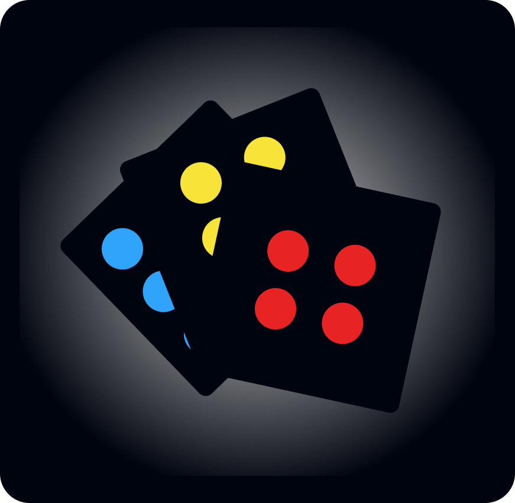
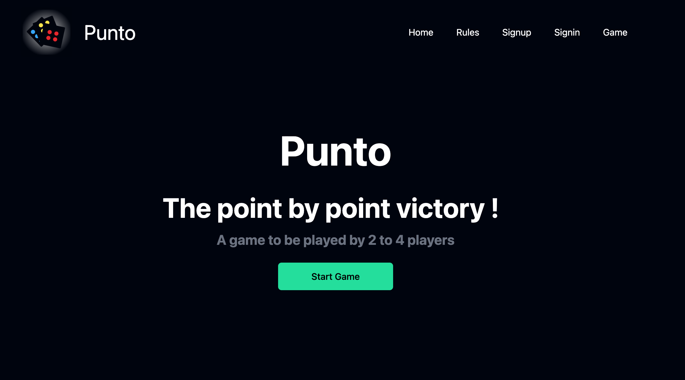

[](https://)
[](https://)

<br/>
<div align="center">
    
    <br/>
    <br/>
    <h1 align="center">Punto</h1>
</div>
  <p align="center">
     Application Web MERN  
    <br />
    <br />
  </p>


<br/>
<br/>

<!-- TABLE OF CONTENTS -->
<details open="open">
  <summary>Table of Contents</summary>

  <ol>
    <li><a href="#illustration">Illustration</a></li>
    <li><a href="#description">Description</a></li>
    <li><a href="#languages">Languages & tools</a></li>
    <li><a href="#objectives">Objectives</a></li>
    <li><a href="#setup">SetUp</a></li>
    <li><a href="#status">Status</a></li>
    <li><a href="#context">Context</a></li>
  </ol>
</details>

<br>
<br>


## Illustration <a id="illustration"></a>



## 🗒 Description <a id="description"></a>
Le but de ce projet est créer une application web pour un jeu de cartes multi joueurs.
L'application est développée avec une stack MERN.


## 🛠 Languages/tools <a id="languages"></a>
### Front
* React 
* Tailwindcss

### Back
* Node.js
* Express
* Mongoose

### Base de données
* mongoDB
* Docker pour stocker la bdd


## 🎯 Objectives <a id="objectives"></a>
- Utiliser les technologies web client 
- La création d'un plateau de jeu et d'un ensemble de cartes
- Travailler avec les bases de données NoSQL
- Gérer un système d'inscription
- Gérer l'authentification
- Mettre en place une logique multi joueurs
- Une gestion de l'historique des parties


##  SetUp <a id="setup"></a>
### Front 
```bash
cd server
npm run start
```
* la partie client est accessible sur le localhost:3000


### Back
```bash
cd client
npm start
```
* la partie serveur est accessible sur le localhost:8000


## 📈 Status <a id="status"></a>

Réalisation cours ...


## 🗓 Context <a id="context"> </a>
Ce projet s'inscrit dans une série de réalisations faites au cours de ma licence en développement logiciel à l'IUT de Vannes.

